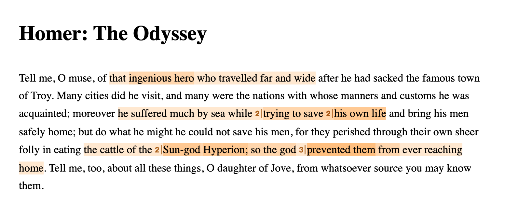

# Text Annotator Inline Markers

An extension to the Recogito Text- and TEI-Annotators that renders inline markers 
when multiple annotations start at the same place, in order to provide better
visibility.



## Usage

```js
import { createTextAnnotator } from '@recogito/text-annotator';
import { InlineMarkersRenderer } from '@recogito/text-annotator-plugin-inline-markers';

const r = createTextAnnotator(contentContainer, {
  // Replace default renderer with this extension
  renderer: InlineMarkersRenderer
});
```

